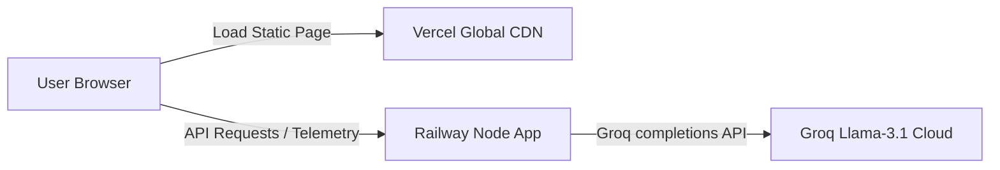

# 🚀 Zepto ContextPulse Deployment Plan

This document outlines the deployment strategy for separating and hosting the **Zepto ContextPulse MVP** across production-grade hosting services:
1. **Frontend Assets:** Hosted on **Vercel** (optimizing global delivery and load times).
2. **Backend API Service:** Hosted on **Railway** (offering simple Node.js execution environments).

---

## 🏗️ Architecture Overview



---

## 🛠️ Step 1: Deploy Backend to Railway

Railway handles Express/Node.js deployments automatically upon repository connection.

### 1. Preparations
Ensure your `.gitignore` file excludes `node_modules` and `.env`. Railway will read your package dependencies directly from [package.json](file:///c:/Users/ADMIN/Desktop/Product%20Owner/MVP_DESIGN/package.json) and run the `npm start` script.

### 2. Railway Console Setup
1. Log into [Railway.app](https://railway.app/).
2. Click **New Project** -> **Deploy from GitHub**.
3. Choose the `MVP_DESIGN` repository.
4. Click **Deploy Now**.

### 3. Configure Environment Variables
Under the **Variables** tab in Railway, set up these keys:
- `PORT` = `8080` (Railway injects this automatically as well)
- `GROQ_API_KEY` = *[Your production Groq API key]*
- `ENV` = `production`

### 4. Expose Public Endpoint
1. Go to **Settings** -> **Public Networking**.
2. Click **Generate Domain**.
3. Copy the URL (e.g. `https://zepto-category-discovery-production.up.railway.app`). This is your **Backend API Base URL**.

---

## ⚡ Step 2: Deploy Frontend to Vercel

Vercel is optimal for hosting the static HTML/CSS/JS frontend located in the [/public](file:///c:/Users/ADMIN/Desktop/Product%20Owner/MVP_DESIGN/public) folder.

### 1. Preparation: Configure API base URL
Open [public/app.js](file:///c:/Users/ADMIN/Desktop/Product%20Owner/MVP_DESIGN/public/app.js) and configure the `API_BASE` variable:
```javascript
// Automatically use local address during development, or point to production Railway endpoint
const API_BASE = window.location.hostname === "localhost" || window.location.hostname === "127.0.0.1"
  ? "" 
  : "https://zepto-category-discovery-production.up.railway.app";
```
*(This logic is already integrated into the frontend code to prevent manual environment adjustments during deployments!)*

### 2. Vercel Console Setup
1. Log into [Vercel](https://vercel.com/).
2. Click **Add New** -> **Project**.
3. Import the `MVP_DESIGN` repository.
4. In **Project Settings**:
   - Set **Build Command** to: `Keep empty (No build script needed)`
   - Set **Output Directory** to: `public`
5. Click **Deploy**.

---

## 🔒 Step 3: Security & CORS Configuration
To ensure cross-origin resource requests are authorized from the Vercel domain to your Railway backend:
- The backend [server.js](file:///c:/Users/ADMIN/Desktop/Product%20Owner/MVP_DESIGN/server.js) contains custom CORS header middleware allowing origin requests:
```javascript
app.use((req, res, next) => {
  res.setHeader("Access-Control-Allow-Origin", "*");
  res.setHeader("Access-Control-Allow-Methods", "GET, POST, OPTIONS, PUT, PATCH, DELETE");
  res.setHeader("Access-Control-Allow-Headers", "X-Requested-With,content-type,Authorization");
  res.setHeader("Access-Control-Allow-Credentials", "true");
  next();
});
```

---

## 🧪 Post-Deployment Verification Checklist
- [ ] Load the Vercel URL: Verify page load times, layout, and images.
- [ ] Cart Additions: Add items to the cart, go to checkout, and verify that the "AI Picks for You" panel loads recommendations from the Railway API.
- [ ] Telemetry Analytics: Verify that adding items and completing a checkout logs conversion metrics on the admin KPI dashboard panel in real-time.
