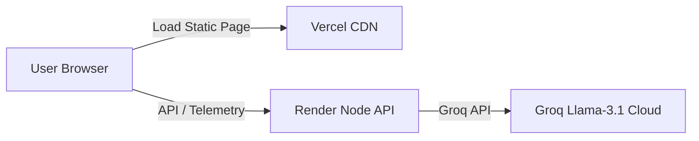

# 🥦 Zepto ContextPulse: AI-Powered Category Discovery MVP

ContextPulse is a premium, AI-powered category discovery engine integrated into the checkout flow. Designed with a custom **Emerald Green & Teal Glassmorphic UI theme**, it replaces generic competitor clones with a distinct, premium identity and helps users discover products from **new categories they have not explored yet**.

## 🌐 Live Demos

* ⚡ **Frontend App (Interactive Simulator):** [https://zepto-ai-native-mvp.vercel.app](https://zepto-ai-native-mvp.vercel.app)
* ⚙️ **Backend API Service:** [https://zepto-ai-native-mvp.onrender.com](https://zepto-ai-native-mvp.onrender.com)

---

## 🏗️ Architecture Overview

The application follows a dual-layered hosting architecture for optimal global performance:
* **Frontend:** Hosted on **Vercel** for lightning-fast edge delivery of static assets.
* **Backend:** Hosted on **Render** (Node.js/Express) connected to the **Groq Llama-3.1 Cloud** for low-latency AI inference.



---

## ✨ Features

1. **🧠 AI Intent Inference & Excluder:**
   * Analyzes cart items to deduce lifestyle profiles (e.g., `[Protein, Oats]` ➔ *Fitness Routine*).
   * Cross-references user history to suppress regularly purchased categories, prioritizing actual exploration.
2. **⚡ Micro-Trials ("Try Something New"):**
   * Curates small, low-friction samples priced strictly under **₹99** to reduce purchase barriers.
3. **📦 Curated Lifestyle Bundles:**
   * Dynamic bundles (e.g., *Healthy Morning Bundle*) that introduce at least one new category with an automated 20% discount.
4. **📊 Analytics & Telemetry:**
   * Built-in KPI logging for Click-Through-Rate (CTR), add-to-carts, checkout completions, and new-category adoption rate.
5. **🛡️ Fail-Safes & Guardrails:**
   * Automatic local fallback matrix if the LLM fails.
   * Bundle price validator guarding against 0-price or incorrect savings outputs from the LLM.

---

## 🛠️ Local Development Setup

### 1. Prerequisites
* Node.js (v18+)
* A Groq API Key

### 2. Installation
Clone the repository:
```bash
git clone https://github.com/yashwanthps71097/Zepto-AI-Native-MVP.git
cd Zepto-AI-Native-MVP
npm install
```

### 3. Environment Setup
Create a `.env` file in the root directory:
```env
GROQ_API_KEY=your_groq_api_key_here
PORT=8080
ENV=development
```

### 4. Running the App
Start the local server:
```bash
npm start
```
By default, the server will start at `http://localhost:8080`.

To view the frontend, serve the `/public` folder or open `public/index.html` directly in your browser.

---

## 📁 File Structure

```text
├── public/                 # Frontend assets (Vercel)
│   ├── index.html          # High-fidelity checkout UI mockup
│   ├── app.js              # State management & API integrations
│   └── styles.css          # Emerald/Teal Glassmorphism theme styles
├── src/                    # Backend API layer
│   ├── services/
│   │   └── groqService.js  # Llama-3.1 Prompt configuration & API client
│   └── mockData.js         # Fallback matrices & static catalogs
├── server.js               # Node/Express Entrypoint & CORS handling
├── vercel.json             # Vercel static routing config
└── README.md               # This file
```

---

## 📈 Success Metrics (Primary KPI)
* Increase the percentage of **Monthly Active Customers (MAC)** purchasing from at least one new category monthly.
* Cross-category adoption & conversion rate tracking.
